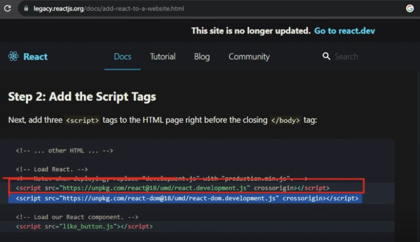
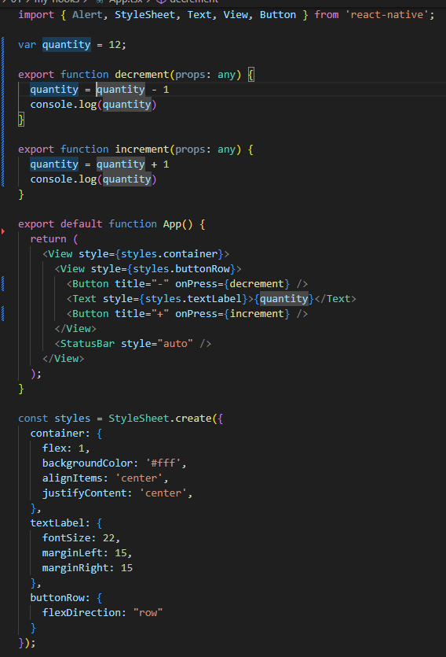
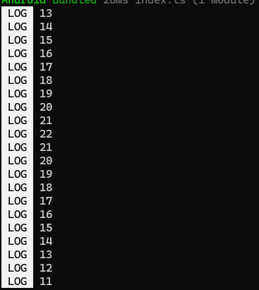
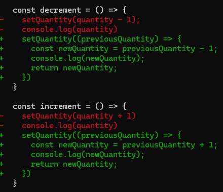

# Introduction

Teacher said that beside sometimes you can see object oriented programming in React Native world, is more common to see functional programming in React world.


# React Dom, React Native and the core

Teacher said that besides we have a different render strategy between React web and React Native, the use the same core.


They differ in strategies to render components and the strategies, but the solutuion at all have common strategies to, as example:

- manage the components;
- send a component from a place to another place;
- manage states;
- manage values.

Teacher make his affirmattion more strong showing that in web we have to include sepparted parts in the application:



And teacher said that this is why you only find results related to "React hooks" and not to "React Native hooks". Hooks are linked to the core, not to a speciic render strategy.

Teacher said that other **examples** of render strategies are:

- One linked to augument reality;
- Other linked to Preact.


# Setup of a test project

Teacher created a test project with the command:

```
npx create-expo-app my-hooks -t
```

Then he selected the template "Blank (Typescript)".

And he executed the project with the commands:

```
cd my-hooks
npm run start
```


# Incrementing and decrementing a quantity without hooks

Teacher developed a code similar o this:



And if you run the code of the image (code of tests/01/my-hooks **now**, I will change in future), you will see that the quantity in the console changes as you expect, but the screen of the app no.



And teacher explained that this occurs because you need a hook to link React Core with React Native libraries.


# Changing the code to use hooks

See this git diff:



As you can see in green, the new code can send to the console the exact value that is presented in the screen.